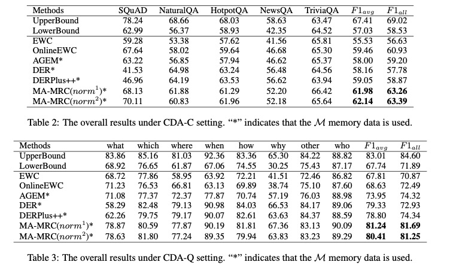

# Continual Machine Reading Comprehension via Uncertainty-aware Fixed Memory and Adversarial Domain Adaptation

This repository provides the official PyTorch implementation of the research paper [Continual Machine Reading Comprehension via Uncertainty-aware Fixed Memory and Adversarial Domain Adaptation] (**Accepted by [Findings of NAACL 2022]**). 

When formatting our code, we adjusted some experimental settings and found some new changes in experimental results, which did not affect the conclusion and content of the paper. 

We have updated the experimental results and uploaded a new version of paper on [arxiv]().

The new main experimental results are as follows:
